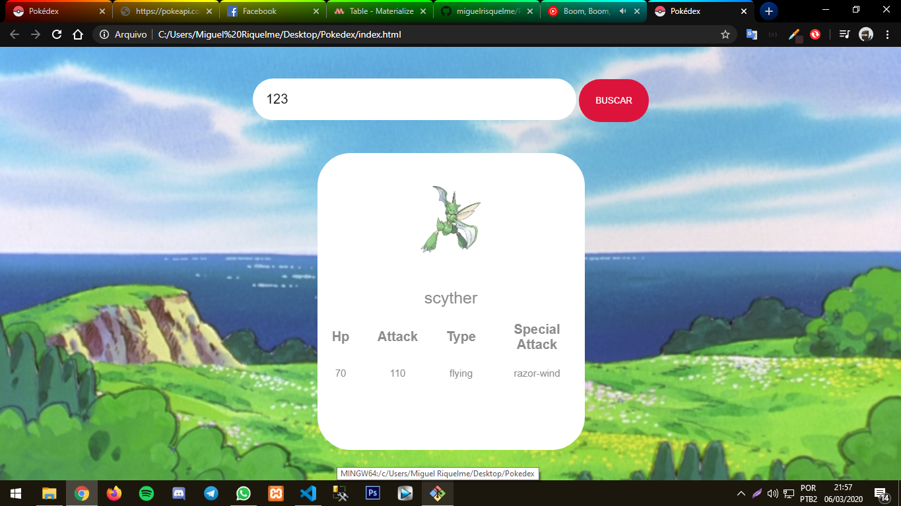
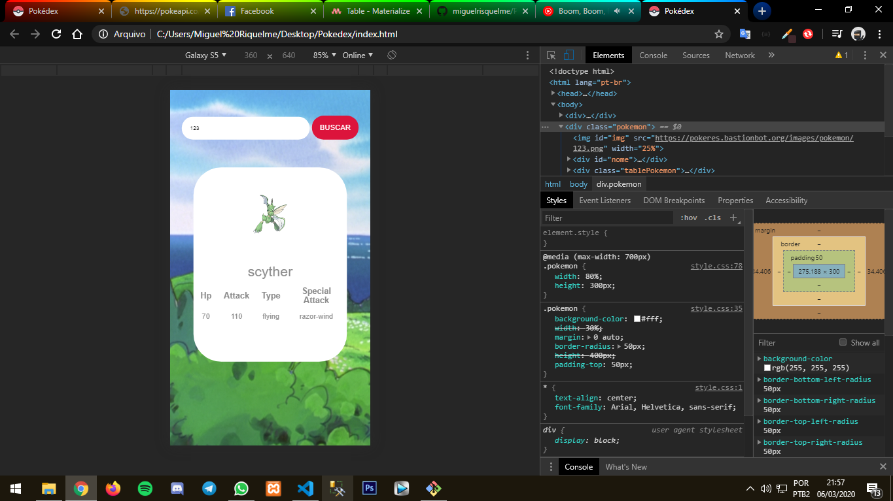

# Pokedex

É um projetinho que eu fiz usando a Poké API junto com uma de imagens, o projeto é responsivo então pode-se ter uma experiência show no smartphone também

## Desenvolvedor:
    - Miguel Riquelme

## Tecnologias utilizadas: 
    - HTML5
    - CSS3
    - JS

## Link das APIs: 
    - PokeAPI: https://pokeapi.co/
    - API para imagens dos pokémons: https://pokeres.bastionbot.org
    - !! Caso tenha alguma dúvida na utilização olhe o código do projeto ou entre em contato comigo !!

## Desktop
### Aqui temos uma ilustração de como fica para desktop

## Smartphone
### Aqui temos uma ilustração de como fica para smartphones

